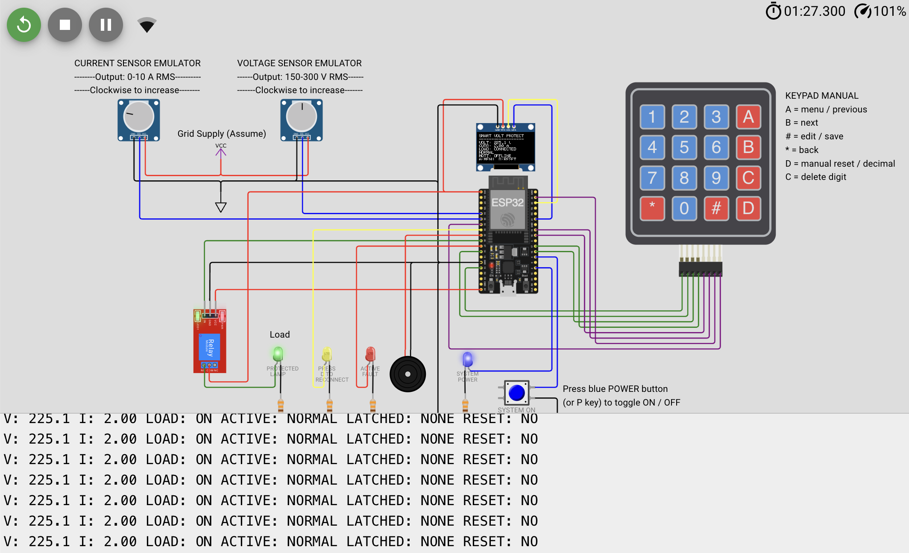
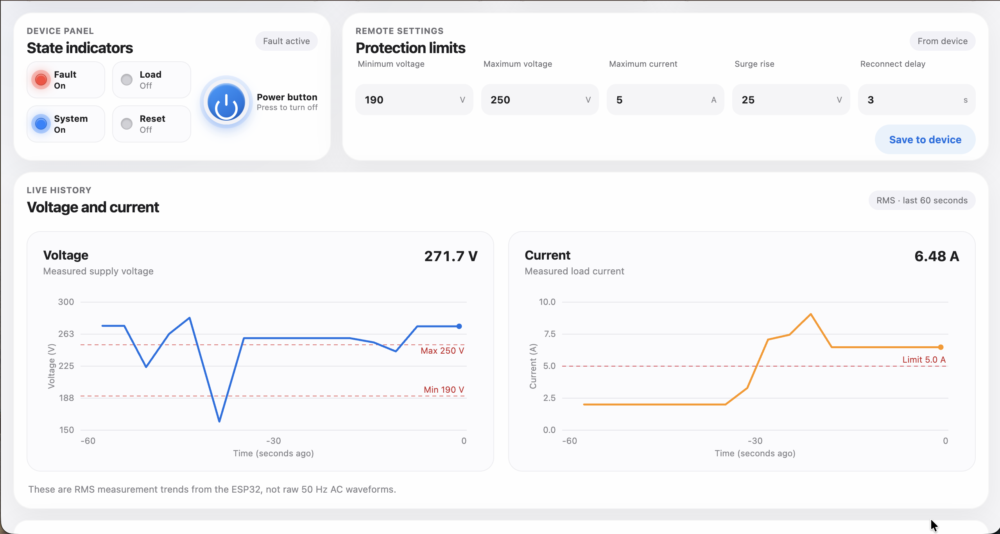

# ESP32 Smart Voltage Protector

**Developed by Md Mahmud Akon**

This project is an ESP32-based voltage protector simulated in Wokwi. It
monitors voltage and current, disconnects the load during a fault, and requires
a manual reset before reconnecting the load. Settings can be changed from the
keypad or the web dashboard.

## Run online

- [Wokwi simulation](https://wokwi.com/projects/477417399320348673)
- [Web dashboard](https://mahmudakonam.github.io/ESP32-Smart-Voltage-Protector/)

1. Open the Wokwi simulation and click **Start Simulation**.
2. Set the voltage and current knobs to healthy values.
3. Press `D` on the keypad to request a safe load connection.
4. Open the web dashboard to view measurements or change settings.

Keep the Wokwi simulation running while using the dashboard.

## Controls

| Control | Function |
| --- | --- |
| Voltage knob | Simulates 150–300 V RMS |
| Current knob | Simulates 0–10 A RMS |
| Blue POWER button or `P` | Turns the simulated system on or off |
| `D` | Requests manual reset and load reconnection |
| `A` / `B` | Opens and moves through the settings menu |
| `#` | Edits or saves a setting |
| `*` | Goes back |
| `C` | Deletes the last digit while editing |

The two potentiometers represent conditioned 0–3.3 V outputs from isolated
voltage and current sensors. They are low-voltage sensor emulators, not direct
mains connections.

## Protection operation

1. Under-voltage, over-voltage, over-current, or a sudden voltage rise opens the
   relay. The red fault LED turns on and the green load LED turns off.
2. When the readings become healthy, the relay remains open and the yellow LED
   indicates that a manual reset is required.
3. Pressing `D` starts the reconnect delay. The relay closes only if the
   readings remain healthy for the full delay.
4. Local protection continues to operate if MQTT is unavailable.

## Run from the repository files

To recreate the simulation in Wokwi, use:

- `project_files/wokwi/sketch.ino`
- `project_files/wokwi/diagram.json`
- `project_files/wokwi/libraries.txt`

To run the dashboard locally:

```sh
python3 -m http.server 8080 --directory src/web
```

Open `http://localhost:8080` in a browser.

The firmware and dashboard use this demonstration MQTT connection:

```text
Broker: broker.hivemq.com
Topic:  fsmb/protector/demo72619
```

## Repository structure

```text
ESP32-Smart-Voltage-Protector/
├── src/                    # Firmware and web dashboard source
├── design_document.pdf     # One-page design report
├── schematics/             # Wokwi wiring diagram
├── test_evidence/          # Test screenshots and notes
├── project_files/          # Wokwi simulation files
└── readme.md
```

## Project evidence

Normal operation with the load connected:



Web dashboard with voltage and current history:



- [One-page design report](design_document.pdf)
- [Complete test evidence](test_evidence/README.md)
- [Wiring diagram](schematics/system_wiring_diagram.png)
