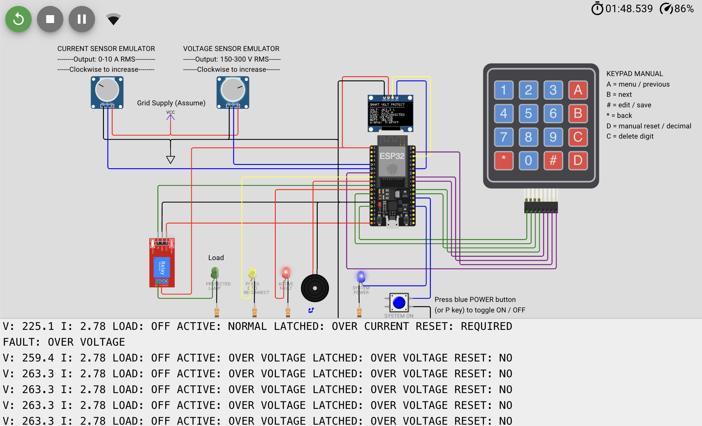

# ESP32 Smart Voltage Protector

**Developed by Md Mahmud Akon**

This project is an ESP32-based voltage protector simulated in Wokwi. It
monitors voltage and current, disconnects the load when an unsafe condition is
detected, and waits for a manual reset before reconnecting it. The settings and
live measurements can be viewed from the device or from a web dashboard.

## Live project

- [Run the Wokwi simulation](https://wokwi.com/projects/477417399320348673)
- [Open the web dashboard](https://mahmudakonam.github.io/ESP32-Smart-Voltage-Protector/)

Keep the Wokwi simulation running while using the dashboard. When the
simulation stops, the dashboard no longer receives live data.

## Main features

- Under-voltage, over-voltage, over-current, and sudden voltage-rise protection
- Relay-controlled load disconnection
- Manual reset with a healthy reconnect delay
- OLED display and keypad settings
- Red, green, blue, and yellow state indicators
- MQTT monitoring and remote settings from a browser
- Local protection that continues working during an MQTT outage

## Run the project online

1. Open the [Wokwi project](https://wokwi.com/projects/477417399320348673).
2. Click **Start Simulation**.
3. Wait for the OLED and Serial Monitor to start.
4. Set both sensor-emulator knobs to healthy values.
5. Press `D` on the keypad to request a safe load connection.
6. Open the [web dashboard](https://mahmudakonam.github.io/ESP32-Smart-Voltage-Protector/)
   on the same computer or another device.

## Controls

| Control | Function |
| --- | --- |
| Voltage knob | Simulates a processed voltage measurement from 150 to 300 V RMS |
| Current knob | Simulates a processed current measurement from 0 to 10 A RMS |
| Blue POWER button or `P` | Turns the simulated protection system on or off |
| `D` | Requests manual reset and load reconnection |
| `A` / `B` | Opens the settings menu and moves between settings |
| `#` | Edits or saves a setting |
| `*` | Goes back |
| `C` | Deletes the last digit while editing |

The two potentiometers represent the conditioned 0–3.3 V outputs of isolated
voltage and current sensors. They do not represent a direct mains connection.

## Protection sequence

1. If a limit is crossed, the ESP32 opens the relay immediately. The red fault
   LED and buzzer turn on, and the green load lamp turns off.
2. When the measurements become healthy again, the red alarm turns off. The
   relay remains open and the yellow LED asks for a manual reset.
3. Pressing `D` starts the reconnect delay. If the readings stay healthy, the
   relay closes and the green load lamp turns on.
4. If the fault returns during the delay, reconnection is cancelled.

## State indicators

| Indicator | Meaning |
| --- | --- |
| Red | A fault is active; relay and load are off |
| Yellow | The fault has cleared, but manual reset is required |
| Green | The relay is closed and the protected load is on |
| Blue | The protection system is powered on |

## Use the included Wokwi files

To recreate the simulation in a new Wokwi ESP32 project, copy these files into
the project:

- `project_files/wokwi/sketch.ino`
- `project_files/wokwi/diagram.json`
- `project_files/wokwi/libraries.txt`

## Run the dashboard locally

From the repository folder, run:

```sh
python3 -m http.server 8080 --directory src/web
```

Then open `http://localhost:8080` in a browser.

## MQTT connection

The firmware and dashboard use the same demonstration connection:

```text
Broker: broker.hivemq.com
Topic:  fsmb/protector/demo72619
```

The public broker is suitable for this demonstration only. Local protection
does not depend on MQTT and continues to work if the connection is lost.

## Why the GitHub workflow is included

`.github/workflows/pages.yml` publishes the files in `src/web` to GitHub Pages.
It runs when the dashboard files change, so the public dashboard link stays up
to date. The workflow is not part of the ESP32 firmware or Wokwi simulation,
and GitHub Actions is not listed as a project contributor.

## Repository structure

```text
ESP32-Smart-Voltage-Protector/
├── src/
│   ├── firmware/sketch.ino
│   └── web/
├── design_document.md
├── schematics/
├── test_evidence/
├── project_files/wokwi/
│   ├── diagram.json
│   ├── sketch.ino
│   └── libraries.txt
└── readme.md
```

## Test evidence

Normal operation with the protected load connected:


Over-voltage fault with the protected load disconnected:



Web dashboard with voltage and current history:


The complete figure list and test notes are in
[test_evidence/README.md](test_evidence/README.md).

## Design files

- [Design document source](design_document.md)
- [Simulation schematic notes](schematics/README.md)

Export `design_document.md` as `design_document.pdf` before the final
submission.
