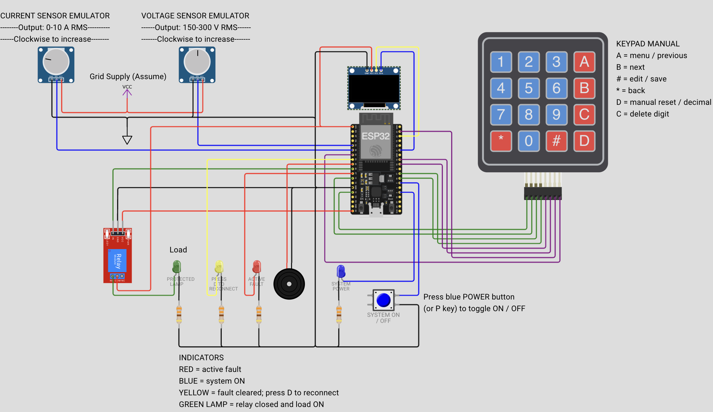
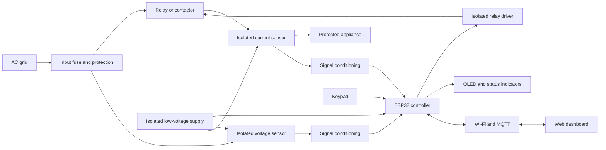

# Schematics

## Wokwi simulation

The two potentiometers imitate the conditioned outputs of voltage and current
sensors. The ESP32 reads these signals, controls the relay, and updates the
OLED, LEDs, buzzer, keypad, and web dashboard. The green LED represents the
protected appliance.

## Real-product block diagram

Wokwi does not simulate a real AC grid or the internal isolation and
conditioning circuits. In real hardware, the design would need suitable
isolation, fuses, clearances, input protection, and a correctly rated
relay/contactor. The simulated circuit must not be connected directly to mains
voltage.
