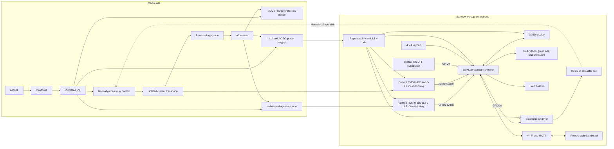

# Schematics

## Wokwi simulation

The two potentiometers imitate the conditioned outputs of voltage and current
sensors. The ESP32 reads these signals, controls the relay, and updates the
OLED, LEDs, buzzer, keypad, and web dashboard. The green LED represents the
protected appliance.

## Real-product block diagram

The voltage sensor is connected before the relay and measures across line and
neutral. This allows the controller to check the grid voltage while the load is
disconnected. The current sensor is in series with the protected load.

Only isolated, conditioned 0-3.3 V signals reach ESP32 GPIO34 and GPIO35. GPIO26
controls the relay coil through a driver; the coil operates the mains contact
mechanically. The blue pushbutton is a controller input, not a mains isolator.

Wokwi replaces both sensing channels with potentiometers and replaces the
appliance with a green LED. A real unit would require certified isolation,
correct fuse and surge-protection ratings, safe creepage and clearance, ADC
input protection, and a relay or contactor rated for the appliance. The
simulated circuit must not be connected directly to mains voltage.
