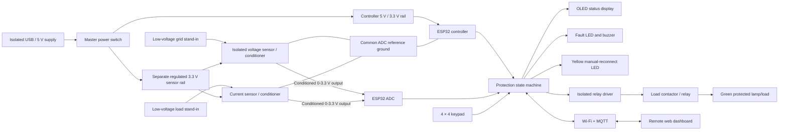

# Product block diagram

The Wokwi knobs are presented as powered sensor-output emulators. They use a
separate labelled 3.3 V sensor rail and provide conditioned ADC signals that the
firmware converts to 150-300 V RMS and 0-10 A RMS. Their ground joins the ESP32
ground only to provide the ADC reference. Wokwi does not simulate the internal
isolation or analog conditioning circuitry.

In real hardware, the master switch must disable both the controller and sensor
rails. A real product would also require galvanic isolation, input fusing,
correctly rated clearances, ADC over-voltage protection, and a properly rated
relay/contactor driver.
